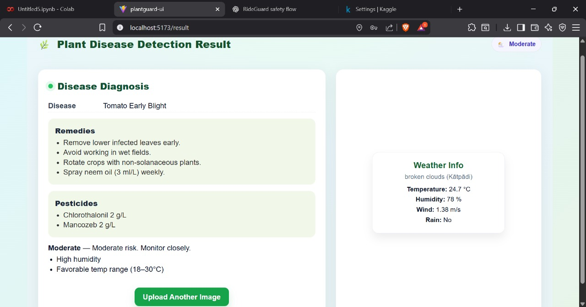

# Plant Disease Detection, Classification and Predictive Health Monitoring System  Using Deep Learning

##  Overview
This project is an end-to-end **Plant Disease Detection, Classification and Predictive Health Monitoring System** designed 
to help farmers identify crop diseases early, receive treatment recommendations, and prevent future outbreaks using weather-based risk forecasting.

The system uses **deep learning (ResNet-18 CNN)** to analyze leaf images and integrates **real-time weather data** to provide preventive alerts,
helping reduce crop loss and unnecessary pesticide usage.

---

##  Key Features
- 🌱 Plant disease detection and classification from leaf images  
- 🧠 Deep learning model (ResNet-18) with **95% accuracy**  
- 💊 Automated remedies and pesticide recommendations  
- 🌦 Weather-based disease outbreak risk prediction (Low / Moderate / High)  
- 🖥 Farmer-friendly web application with instant results  

---

## 🛠 Tech Stack
**Frontend**
- React.js
- CSS
- Vite

**Backend**
- Python
- Flask
- REST APIs

**Machine Learning**
- Convolutional Neural Networks (ResNet-18)
- PyTorch / TensorFlow
- Image preprocessing & augmentation

**Other Tools**
- Weather APIs
- Firebase 
- Git & GitHub

---

##  System Architecture
1. User uploads a leaf image through the web interface  
2. Image is preprocessed and sent to the backend  
3. CNN model classifies the disease and confidence score  
4. Remedies and pesticide suggestions are generated  
5. Weather data is analyzed to predict outbreak risk  
6. Final report is displayed to the user  

---

## 📸 Application Screenshots
> Screenshots of the user interface are shown below.

### 🔐 Authentication / Create Account


### 📤 Upload Leaf Image


### 📊 Disease Detection Result


---

##  How to Run the Project

### Backend
```bash
cd plantguard-backend
pip install -r requirements.txt
python app.py
### frontend
cd plnt-uii
npm install
npm run dev

